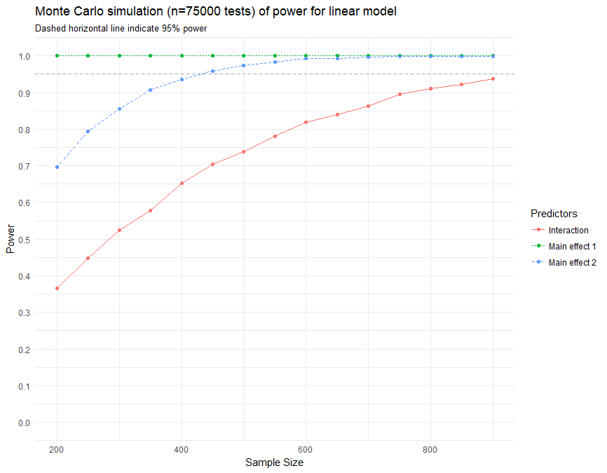
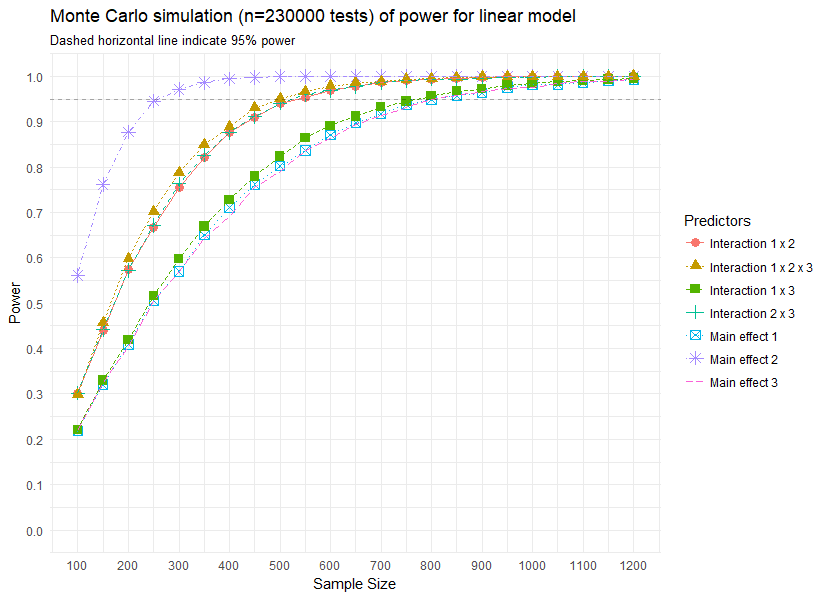

# lm-interaction-power

Monte Carlo simulation of power for linear model with interactions using the superb [paramtest](https://cran.r-project.org/web/packages/paramtest/vignettes/Simulating-Power.html) package.

## Two independent variables

Assumptions:

- statistical test: `lm`
- alpha: `.05`
- predictor effect sizes:
  - b1: `.5` (sd: `1`)
  - b2: `.15` (sd: `1`)
  - b1 * b2: `.10`
- residual variance: `yvar <- sqrt(1 - b1^2 - b2^2 - b3^2)`

## Three independent variables

Assumptions:

Just look at the source code...
